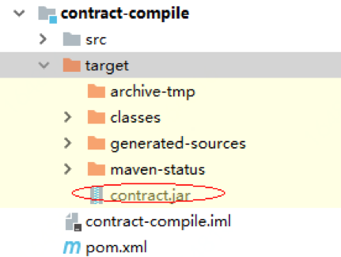

## jdchain-start快速使用说明

### 1.	简介
本工程已经构建了基本的开发环境，意在快速帮助用户开发、编译、发布和执行合约。用户在contract-compile模块下，首先根据com.jd.blockchain.contract包下的合约样例，编写适合自己的新合约。然后执行mvn clean package进行编译，在输出路径中找到对应的xxx.jar合约文件。然后将此合约压缩包在测试链上部署并执行。

快速使用样例下载地址：https://github.com/blockchain-jd-com/jdchain-starter.git ，在此工程的readme.txt中也有相关说明。

#### 1.1.	准备
用户可直接通过maven中央库来获取jar。
##### 1.1.1 基于SDK“数据快速上链”方式的maven坐标

```java
<dependency>
    <groupId>com.jd.blockchain</groupId>
    <artifactId>sdk-client</artifactId>
    <version>0.8.2.RELEASE</version>
</dependency>
```

#####1.1.2 基于“快速开发合约代码”方式的maven坐标

```java
<dependency>
	<groupId>com.jd.blockchain</groupId>
	<artifactId>contract-model</artifactId>
	<version>0.8.2.RELEASE</version>
</dependency>
```

### 2. 数据快速上链

#### 2.1. 服务连接


```java
//创建服务代理
public static BlockchainKeyPair CLIENT_CERT = BlockchainKeyGenerator.getInstance().generate();
final String GATEWAY_IP = "127.0.0.1";
final int GATEWAY_PORT = 80;
final boolean SECURE = false;
GatewayServiceFactory serviceFactory = GatewayServiceFactory.connect(GATEWAY_IP, GATEWAY_PORT, SECURE,
		CLIENT_CERT);
// 创建服务代理；
BlockchainService service = serviceFactory.getBlockchainService();
```

#### 2.2. 账户注册

```java
	// 创建服务代理；
    BlockchainService service = serviceFactory.getBlockchainService();
    // 在本地定义注册账号的 TX；
    TransactionTemplate txTemp = service.newTransaction(ledgerHash);		
    SignatureFunction signatureFunction = asymmetricCryptography.getSignatureFunction(CryptoAlgorithm.ED25519);
    CryptoKeyPair cryptoKeyPair = signatureFunction.generateKeyPair();
    BlockchainKeyPair user = new BlockchainKeyPair(cryptoKeyPair.getPubKey(), cryptoKeyPair.getPrivKey());
    
    txTemp.users().register(user.getIdentity());
    
    // TX 准备就绪；
    PreparedTransaction prepTx = txTemp.prepare();
    // 使用私钥进行签名；
    CryptoKeyPair keyPair = getSponsorKey();
    prepTx.sign(keyPair);
    
    // 提交交易；
    prepTx.commit();
```

#### 2.3. 写入数据

```java
	// 创建服务代理；
    BlockchainService service = serviceFactory.getBlockchainService();
    
    HashDigest ledgerHash = getLedgerHash();
    // 在本地定义注册账号的 TX；
    TransactionTemplate txTemp = service.newTransaction(ledgerHash);
    
    // --------------------------------------
    // 将商品信息写入到指定的账户中；
    // 对象将被序列化为 JSON 形式存储，并基于 JSON 结构建立查询索引；
    String commodityDataAccount = "GGhhreGeasdfasfUUfehf9932lkae99ds66jf==";
    Commodity commodity1 = new Commodity();
    txTemp.dataAccount(commodityDataAccount).set("ASSET_CODE", commodity1.getCode().getBytes(), -1);
    
    // TX 准备就绪；
    PreparedTransaction prepTx = txTemp.prepare();
    
    String txHash = ByteArray.toBase64(prepTx.getHash().toBytes());
    // 使用私钥进行签名；
    CryptoKeyPair keyPair = getSponsorKey();
    prepTx.sign(keyPair);
    
    // 提交交易；
    prepTx.commit();
```

#### 2.4. 查询数据

```java
	// 创建服务代理；
    BlockchainService service = serviceFactory.getBlockchainService();
    
    // 查询区块信息；
    // 区块高度；
    long ledgerNumber = service.getLedger(LEDGER_HASH).getLatestBlockHeight();
    // 最新区块；
    LedgerBlock latestBlock = service.getBlock(LEDGER_HASH, ledgerNumber);
    // 区块中的交易的数量；
    long txCount = service.getTransactionCount(LEDGER_HASH, latestBlock.getHash());
    // 获取交易列表；
    LedgerTransaction[] txList = service.getTransactions(LEDGER_HASH, ledgerNumber, 0, 100);
    
    // 根据交易的 hash 获得交易；注：客户端生成 PrepareTransaction 时得到交易hash；
    HashDigest txHash = txList[0].getTransactionContent().getHash();
    Transaction tx = service.getTransactionByContentHash(LEDGER_HASH, txHash);
    // 获取数据；
    String commerceAccount = "GGhhreGeasdfasfUUfehf9932lkae99ds66jf==";
    String[] objKeys = new String[] { "x001", "x002" };
    KVDataEntry[] kvData = service.getDataEntries(LEDGER_HASH, commerceAccount, objKeys);
    
    long payloadVersion = kvData[0].getVersion();
```

### 3. 快速开发合约代码
#### 3.1.	开发
入门样例可参照：com.jd.blockchain.contract.AssetContract3，合约类实现EventProcessingAwire接口，同时在合约的入口方法上添加注解：@ContractEvent(name = "xxx")，形参为：ContractEventContext eventContext。

格式如下：
```java
public class AssetContract3 implements EventProcessingAwire{
@ContractEvent(name = "xxx")
public void test1(ContractEventContext eventContext){
}
}
```

合约中可以通过ContractEventContext对象来调用账本中的相关方法，比如：
```java
BlockchainAccount holderAccount = eventContext.getLedger().getAccount(currentLedgerHash(), assetHolderAddress);
```

#### 3.2.	编译

编译工作在contract-compile工程中进行。在控制台中执行：mvn clean package来直接编译生成所需的合约压缩包。

注意修改pom.xml文件中<filename>和<mainClass>这两个属性：

```xml
<plugin>
    <artifactId>maven-assembly-plugin</artifactId>
    <configuration>
        <finalName>contract</finalName>
        <appendAssemblyId>false</appendAssemblyId>
        <archive>
            <manifest>
                <mainClass>com.jd.blockchain.contract.AssetContract3</mainClass>
            </manifest>
        </archive>
......					

```

#### 3.3.	发布
编译完成之后，根据如上的配置，会在target目录下生成对应的合约压缩文件：contract.jar。




##### 3.3.1.	sys-contract.properties
配置测试资源中的sys-contract.properties文件：

```properties
#常规使用;
ownerPubPath=xxx/conf/jd-com.pub
ownerPrvPath=xxx/conf/jd-com.priv
ownerPassword=xxx/conf/ownerPassword.txt
ledgerHash=6Gw3cK4uazegy4HjoaM81ck9NgYLNoKyBMb7a1TK1jt3d

host=192.168.151.45
port=8081
#合约使用如下;
event = issue-asset
chainCodePath=xxx/AssetContract3.contract
contractArgs=10##4##abc

```

##### 3.3.2.	发布和执行合约

运行IntegrationTest.java中的如下方法来发布和执行合约：
```
one_deploy_exe_contract_on_test_gateway()
```

具体代码如下：
```java
/**
 * 在测试链上仅发布和执行合约;
 */
private void deploy_exe_contract_on_test_gateway(){
	//then exe the contract;
	//由于合约发布之后需要后台进行共识处理，需要一定的时间消耗，先休息5秒钟之后再执行;
	try {
		Thread.sleep(1000L);
		boolean deployResult = ContractDeployExeUtil.instance.deploy(host, port, ledger,ownerPubPath, ownerPrvPath, ownerPassword, chainCodePath,contractPub);
		System.out.println("deployResult="+deployResult);
		Thread.sleep(2000L);
		boolean exeResult = false;
		exeResult = ContractDeployExeUtil.instance.exeContract(ledger,ownerPubPath, ownerPrvPath, ownerPassword,eventName,contractArgs);
		System.out.println("execute the contract,result= "+exeResult);
	} catch (InterruptedException e) {
		e.printStackTrace();
	}
}
```

```java
// 发布完成之后，会在控制台中生成如下信息：
contract's address=5SmDBPXfXoSsJmfJskkpeVbZkxfkawqWE9CE
deployResult=true
```

#### 3.4.	执行
执行即如上的方法：

```java
ContractDeployExeUtil.instance.exeContract(ledger,ownerPubPath, ownerPrvPath, ownerPassword,eventName,contractArgs);
```

在执行完成之后，可以在api接口中查询相关的信息。

##### 3.4.1.	根据合约地址查询
http://192.168.151.45:7080/ledgers/6Gw3cK4uazegy4HjoaM81ck9NgYLNoKyBMb7a1TK1jt3d/contracts/5SmDBPXfXoSsJmfJskkpeVbZkxfkawqWE9CE

结果：

```json
{
"data": {
"address": "5SmDBPXfXoSsJmfJskkpeVbZkxfkawqWE9CE",
"chainCode": "UEsDBBQACAgIAACAlE0AAAAAAAAAAAAAAAAJAAQATUVUQS1JTkYv/soAAAMAUEsHCAAAAAACAAAAAAAAAFBLAwQUAAgICAAAgJRNAAAAAAAAAAAAAAAAFAAAAE1FVEEtSU5GL01BTklGRVNULk1G803My0xLLS7RDUstKs7Mz7NSMNQz4OVyLkpNLElN0XWqBAlY6BnEG5qYKGj4FyUm56QqOOcXFeQXJZYA1WvycvFyAQBQSwcInnx2U0QAAABFAAAAUEsDBBQACAgIAACAlE0AAAAAAAAAAAAAAAATAAAAY29udHJhY3QucHJvcGVydGllc1OOKTU1MbCIKTV3dTQDkmZuQLapobkxkHQ2dY0pNTMwMuflUg7JKFVwSU1WMDJQMDSzMjCwMjBUcA4OAfINLXi5kvPzSooSk0tsk/Nz9bJS9JJy8pOzkzMSM/P0YFJ6jsXFqSXOUJ4xLxcAUEsHCBckArNrAAAAegAAAFBLAQIUABQACAgIAACAlE0AAAAAAgAAAAAAAAAJAAQAAAAAAAAAAAAAAAAAAABNRVRBLUlORi/+ygAAUEsBAhQAFAAICAgAAICUTZ58dlNEAAAARQAAABQAAAAAAAAAAAAAAAAAPQAAAE1FVEEtSU5GL01BTklGRVNULk1GUEsBAhQAFAAICAgAAICUTRckArNrAAAAegAAABMAAAAAAAAAAAAAAAAAwwAAAGNvbnRyYWN0LnByb3BlcnRpZXNQSwUGAAAAAAMAAwC+AAAAbwEAAAAA",
"chaincodeProof": {
"dataHash": {
"value": "6LwUAHD8zZbANkdJL8bBHpYM2BYduZpQXzaV5T92XxyLL"
},
"dataNode": {
"key": "CHAIN-CODE",
"level": 0,
"nodeHash": {
"value": "6LwUAHD8zZbANkdJL8bBHpYM2BYduZpQXzaV5T92XxyLL"
},
"sN": 0,
"version": 0
},
"levels": 1,
"rootHash": {
"value": "65WEJwZWpdpv5A8BWDqsJQxW33qBR16q4Bx8tzUTbSUWv"
},
"sN": 0
},
"chaincodeVersion": 0,
"pubKey": {
"value": "mayaPm1C7opEhSyRtmH7rkbmxAX2MvrzUguFkgcJ7mpfQY"
},
"rootHash": {
"value": "65WEJwZWpdpv5A8BWDqsJQxW33qBR16q4Bx8tzUTbSUWv"
}
},
"success": true
}
```
