# 从零开始部署JDChain
（基于JDChain1.1.1.RELEASE版本搭建）  
为了快速部署JDChain区块链，京东区块链研发团队特意开发了一个很好用的前端管理工具，减少用户的各种繁琐操作。现在就来介绍一下。  
新的管理工具在web页面上快速实现JDChain的初始化和peer节点启动。  
操作视频：https://3.cn/TDtyTS4Ze （下载JDChain1.1.1.RELEASE版本的文件，最好同步下载字幕）。  
## 1.流程图
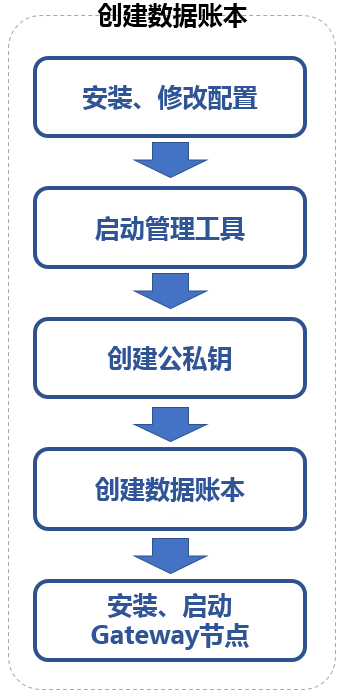
## 2.操作步骤
### 2.1安装、修改配置
从ledger.jd.com下载安装包，其中jdchain-peer-1.1.1-xxx.zip为peer节点压缩包，jdchain-gateway-1.1.1-xxx.zip为网关压缩包。  
如果peer节点部署在不同的机器上，可采用默认端口来安装；如果peer节点部署在同一台机器上，则需要修改管理工具（后检查jump）和peer节点的默认端口，避免冲突。  
首先我们来做一些假定：  
假定管理工具的端口定义为：8000/8001/8002/8003 ；  
假定peer节点的启动端口定义为：7080/7081/7082/7083 ；  
假定JDChain项目的安装路径为：/export/jdchain 。  
选择其中的一组来修改，具体如下（如果为不同机器部署，只需执行如下步骤①和②）：  
①	 确定路径 cd /export/jdchain  
②   解压Peer节点安装包   unzip jdchain-peer-1.1.1.RELEASE.zip –d peerX  
③	 确定路径 cd /export/jdchain/peerX/bin  
④	 修改manager端口    vi manager-startup.sh  
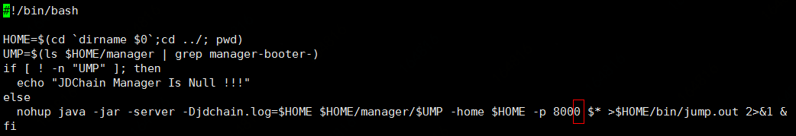  
⑤ 修改peer启动端口和内存大小，本机测试建议改为512m   vi peer-startup.sh  
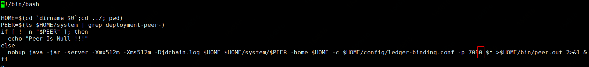  
### 2.2启动管理工具  
①	进入可执行脚本目录 cd /export/jdchain/peerX/bin  
②	执行： sh manager-startup.sh  
如果想查看日志后台，可通过如下命令查看： tail –f jump.out –n 100  
### 2.3创建公私钥
登录管理端工具，比如：http://192.168.151.39:8000  
点击左侧菜单：公私钥管理-》生成公私钥。在弹出的界面中填写相关信息：  
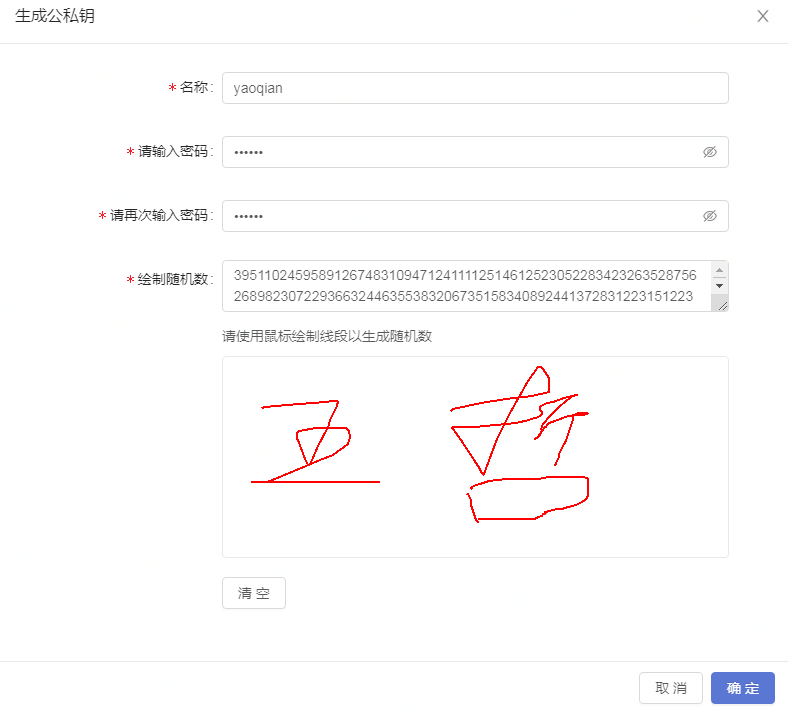  
### 2.4.创建数据账本
点击左侧菜单：账本-》初始化账本，选择一台机器作为协调方，其它的作为参与方。  
每个节点填写内容之后先不要点击“保存配置信息”按钮，都填写完成之后统一，先保存协调方，其它依次快速保存。  
注意事项：  
①	参与方要使用协调方的邀请码；  
②	共识协议：目前为：Bftsmart；  
③	密码算法：默认；  
④	参与方数量：包含协调方在内；  
⑤	共识节点信息：如果在同一台机器，一定要保证共识端口不同；  
⑥	初始化共识地址：如果在同一台机器，一定要保证共识端口不同；  
⑦	peer节点公钥：选择刚才创建的公钥；  
⑧	数据库名称：在同一个机器上的名称不能重复。  
⑨	由于peer节点之间的通信设置了时延，一定要确保四个peer节点的配置都无误的前提下，在尽可能短的时间内同时点击界面下方的“保存配置信息”按钮。  
#### 协调方配置信息如下：
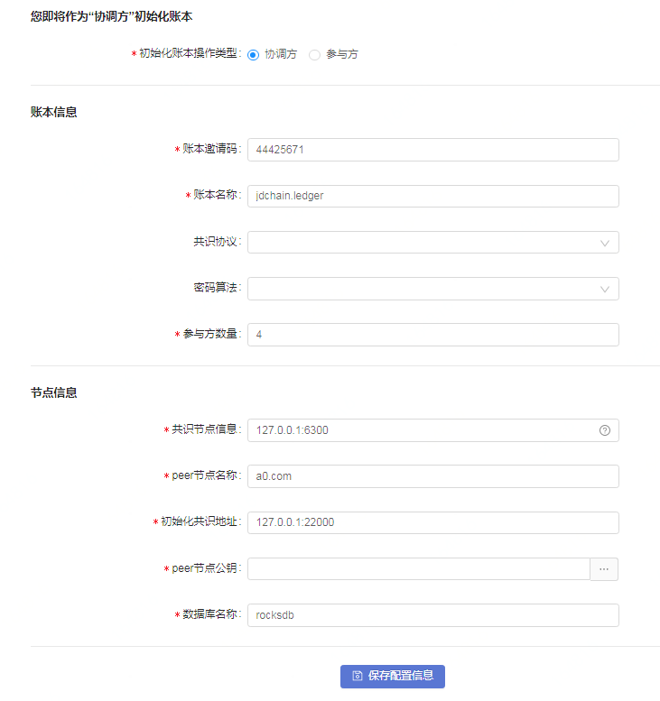  
#### 参与方配置信息如下：
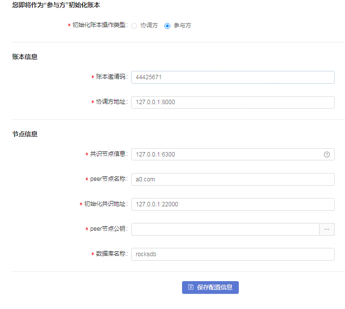  
四个参与方都点击“保存配置信息”后，配置信息会在四个参与方之间共享。界面如下：  
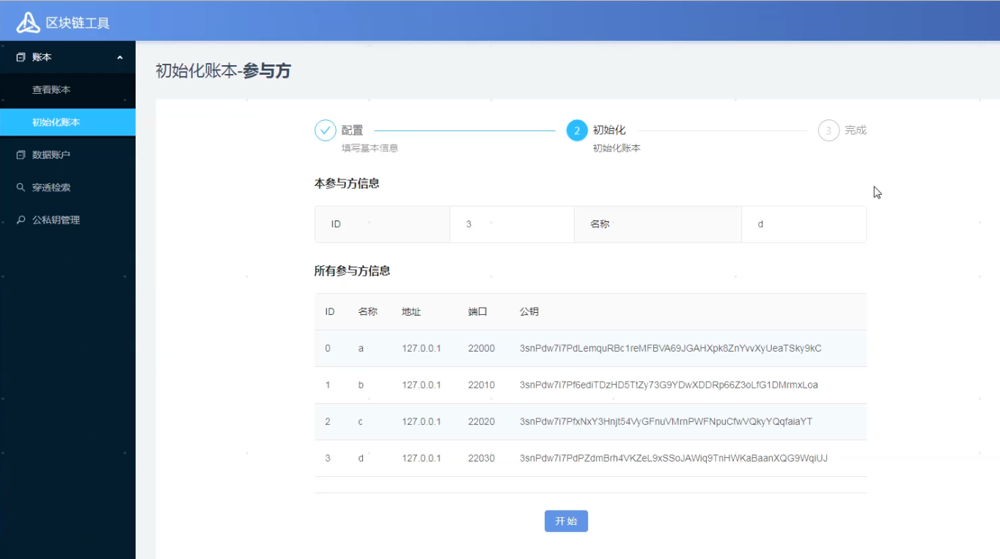  
然后点击界面下方的“开始”按钮，则启动四个参与方的初始化操作，初始化进度会在下方展示。最终展示界面如下：  
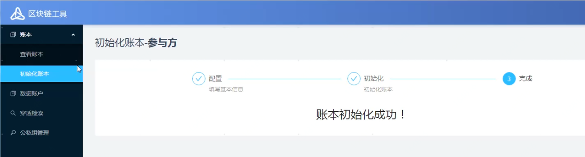  
一定要确保所有的账本初始化都完成之后，再进行后续操作。初始化完成表示创世区块已经创建。  
然后点击菜单：账本-》查看账本，刚生成的账本会在内容区展示。点击其中的“启动节点”按钮，即可启动peer节点（见下图）。  
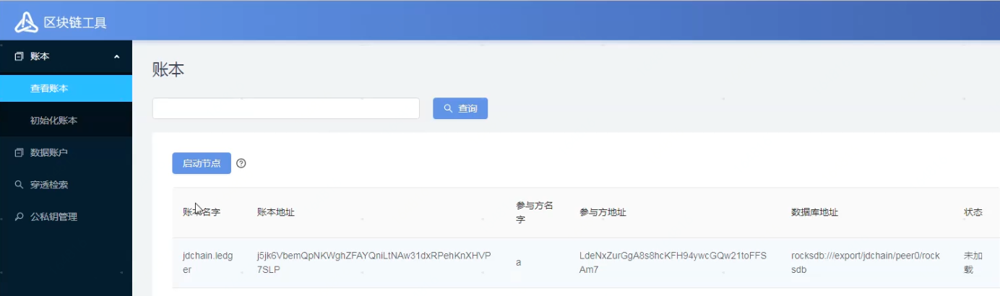  
启动无误后，状态展示为：已启动-》已加载。  
### 2.5.安装、启动Gateway节点
①	确定路径 cd /export/jdchain  
②	解压gateway节点安装包     
unzip jdchain-gateway-1.1.1.RELEASE.zip –d gw  
③	管理端查看公、私钥  
④	查看加密后的口令  
cd peer0 → cd config/keys  → more *.pwd  
⑤	修改端口 、添加公私钥    
cd /export/jdchain/gw/config   
vi gateway.conf    
⑥	启动管理工具   sh startup.sh  
⑦	稍等片刻，可通过web页面访问区块链浏览器，格式为：http://192.168.151.39:18081，界面如下：  
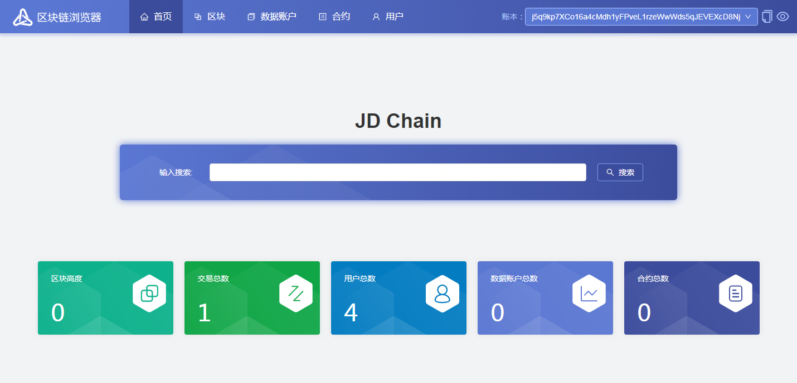  
#### 注意事项：
①	公私钥可以在管理工具的“公私钥管理”中获得，但私钥的解密密码（keys.default.privkey-password参数），需要通过登录后台才能查看，即上文中的第④步。  
②	注意，公钥以3sn开头，私钥以177开头。  
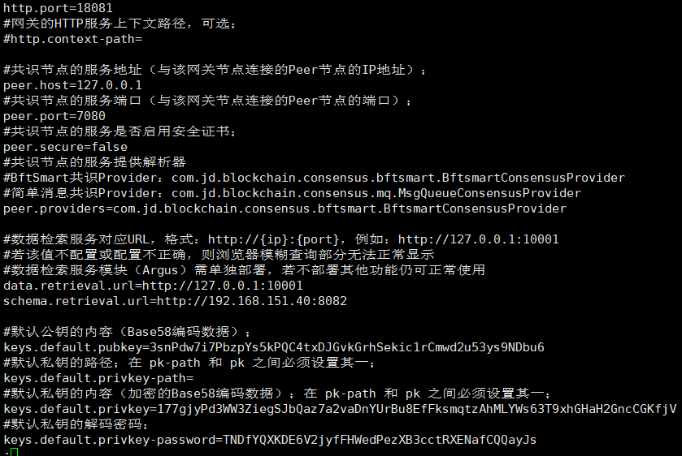  

